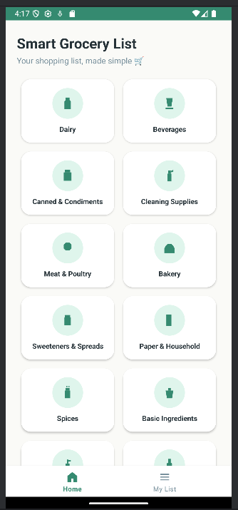
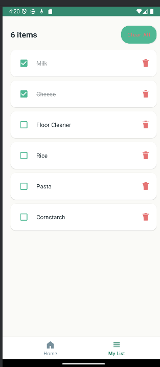
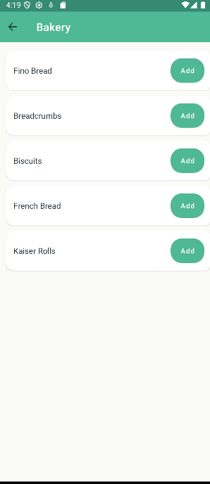

# 🛒 Smart Grocery List

A simple Android shopping list app built with **Java and XML**.

Users can browse grocery products by category, add items to a shopping list, mark them as purchased, and delete items. Data is stored locally on the device using **SharedPreferences**.

## ✨ Features

* Browse grocery products by category
* Add products to a shopping list
* Prevent duplicate items
* Mark items as purchased
* Delete individual items or clear the list
* Local data persistence with SharedPreferences
* Clean and modern UI

## 🛠️ Built With

* Java
* XML
* Android Studio
* RecyclerView
* Fragment
* CardView
* BottomNavigationView
* SharedPreferences

## 📱 Screenshots

| Home | Products | My List | Bakery |
| :---: | :---: | :---: | :---: |
|  |  |  |  |

## 🚀 Run the Project

1. Clone the repository
2. Open it in **Android Studio**
3. Let Gradle sync
4. Run the app on an emulator or Android device

**Min SDK:** 21

## 📄 License

Open source for learning and portfolio purposes.
